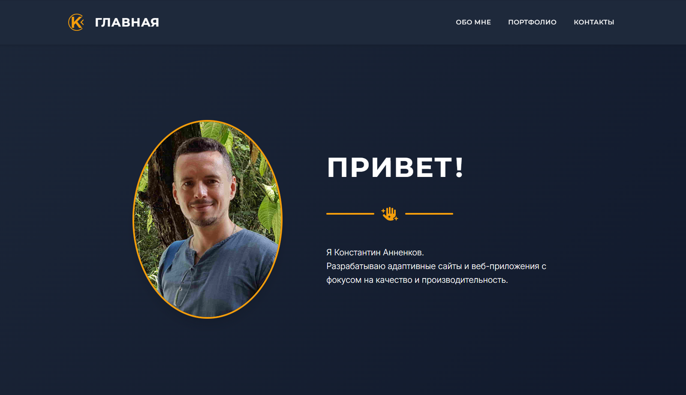

# 🏛️ Личное портфолио (pheb.ru)

<div align="center">


</div>

### Превью проекта


### Интерфейс сайта



[🔗 Перейти на сайт](https://pheb.ru/) • [💻 Исходный код](https://github.com/Annenkov-Konstantin/pheb-portfolio)

Адаптивный сайт-портфолио Frontend-разработчика. Сайт спроектирован с упором на производительность, доступность (a11y) и чистую семантическую вёрстку.

## 📄 Страницы

- **Главная** — hero-секция, представление, призыв к действию
- **Обо мне** — опыт, навыки, подход к работе
- **Портфолио** — динамический рендеринг проектов через JS + модальные окна
- **Контакты** — форма обратной связи с защитой от спама, соцсети, доступность

## 🛠 Стек технологий

- **Вёрстка:** HTML5, CSS3 (Grid, Flexbox, Custom Properties)
- **JavaScript:** Vanilla JS (ES6+) + jQuery (UI-компоненты Bootstrap)
- **Фреймворк:** Bootstrap 5 (сетка и утилиты)
- **Бэкенд:** PHP (обработчик формы)
- **Иконки:** Font Awesome, SVG-спрайты
- **Оптимизация:** Preload шрифтов, Open Graph, variable fonts

## ✨ Ключевые особенности

### 🎨 Интерфейс

- **Динамическое модальное окно** — рендеринг карточек проектов через JS из массива данных
- **3D tilt-эффект** — карточки портфолио наклоняются при наведении мыши (jQuery Tilt)
- **Адаптивная сетка** — CSS Grid с `auto-fit` и `minmax`, плавные переходы между брейкпоинтами
- **Кастомные скроллбары** — стилизованные через `::-webkit-scrollbar` и `scrollbar-width`
- **SVG-спрайты** — иконки логотипа и соцсетей через `<use href="sprite.svg#...">`

### ⚡ Производительность

- **Preload шрифтов** — variable fonts (Inter, Montserrat) загружаются параллельно с CSS
- **Оптимизация графики** — SVG-спрайты вместо множества файлов
- **Open Graph мета-теги** — красивые превью при шаринге в соцсетях

### ♿ Доступность (a11y)

- **Семантическая вёрстка** — `<header>`, `<nav>`, `<main>`, `<footer>`, `<article>`
- **Корректная работа с клавиатуры** — фокус возвращается к триггеру после закрытия модалки
- **ARIA-атрибуты** — `aria-hidden`, `aria-label`, `.sr-only` для скринридеров
- **Контрастность** — соответствие WCAG по соотношению цветов

### 🔒 Безопасность

- **Honeypot-защита формы** — скрытое поле, создаваемое динамически через JavaScript
- **Проверка времени заполнения** — отклонение форм, отправленных быстрее 3 секунд
- **Серверная валидация** — проверка данных на PHP перед отправкой
- **Защита от инъекций** — фильтрация специальных символов

## 🚀 Запуск

Проект является статическим сайтом. Варианты запуска:

### Самый простой способ

Просто открой `index.html` в любом современном браузере (двойной клик по файлу).

### Через Live Server (VS Code)

1. Установи расширение **Live Server**
2. Кликни правой кнопкой на `index.html` → "Open with Live Server"

## 📁 Структура проекта

```
pheb-portfolio/
├── index.html              # Главная страница
├── about.html              # Обо мне
├── portfolio.html          # Портфолио
├── contact.html            # Контакты
├── post.php                # Обработчик формы обратной связи
├── css/
│   └── styles.css          # Основные стили
├── js/
│   ├── main.js             # Основная логика сайта
│   ├── script.js           # Вспомогательные скрипты
│   ├── tilt.jquery.min.js  # jQuery-плагин для 3D-эффекта наклона карточек
│   └── data/
│       └── portfolio-data.js   # Данные проектов (массив)
├── assets/
│   ├── fonts/              # Variable fonts (Inter, Montserrat)
│   └── img/                # Изображения, OG-картинка, превью
├── svg/
│   └── sprite.svg          # SVG-спрайт с иконками
└── README.md
```

## 🔮 Возможные улучшения

- [ ] Переписать на React + TypeScript
- [ ] Добавить тёмную/светлую тему
- [ ] Интеграция с CMS для управления проектами
- [ ] Добавить блог-секцию
- [ ] Перевод на несколько языков
- [ ] Кастомная валидация полей формы

## 📬 Контакты

Если у вас есть вопросы по проекту или вы хотите сотрудничать:

- **Сайт:** [pheb.ru](https://pheb.ru/)
- **Email:** pheb@list.ru
- **Telegram:** [@Knfrei](https://t.me/Knfrei)
- **GitHub:** [@Annenkov-Konstantin](https://github.com/Annenkov-Konstantin)

## 📚 Источники и оригинальный репозиторий

ℹ️ **Примечание:** Этот репозиторий содержит код проекта, перенесённый для удобства демонстрации в портфолио. Частичная история разработки доступна в [оригинальном репозитории](https://github.com/Annenkov-Konstantin/ono-tebe-nado).

---

<div align="center">

**Если проект был полезен, поставьте ⭐ на GitHub!**

</div>
